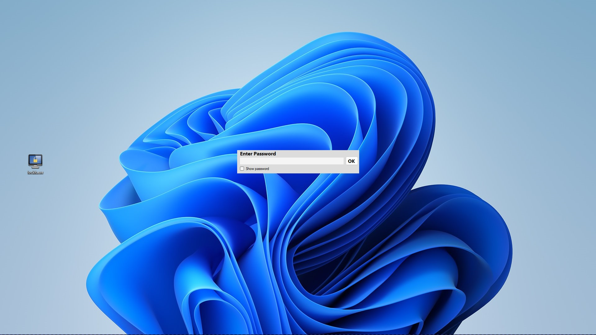
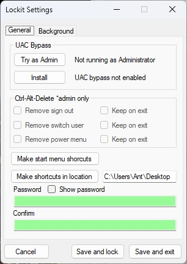
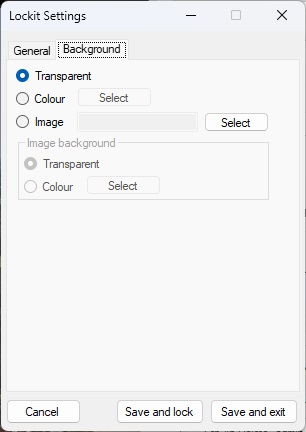

## Lockit

A simple screen locking utility with a few features.\
It started off as a way to block access to a windows pe interface.\
I had tried a couple of other screen lockers but found they had a few flaws.

### Features Compared To Other Lockers:

* Locks secondary screens not just the primary monitor.
* Attempts to keep itself on top of all windows.
* Detects any window trying to force itself on top and minimizes them
(But you will have to run this program as admin to be able to minimize windows with higher privileges like task manager with always on top set)
* Can use windows task scheduler to bypass UAC prompts when running as Administrator.
* Stores password encrypted.
* Has configurable backgrounds.

\

Written in C# with Microsoft Visual Studio Community 2022